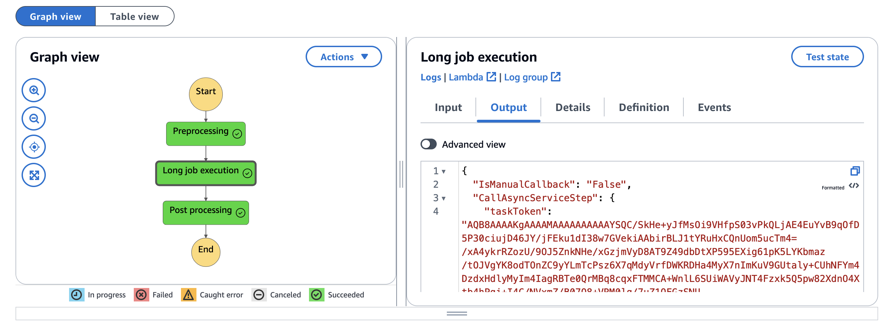

## Demo to pause and resume a step function, using AWS CDK

### Description

The package demonstrates an example to pause and resume a step function execution using [AWS CDK](https://aws.amazon.com/cdk/) (infrastructure as code).
1. Infrastructure is written with **typescript**
2. Code to call an external service and to resume the step function is written with **python**

With the `npx cdk deploy` you can deploy the `PausableStepFunctionStack` stack to an aws account. The deployment creates:
1. PausableStepFunction - an AWS step function, that contains 3 steps:
   1. **Preprocessing** - a dummy step to simulate some preprocessing work
   2. **Long job execution** - a step, at which the execution pauses, waiting for the specified token. It can call another long-running service or that requires manual intervention to resume the workflow.
   3. **Post processing** - the last, dummy step to simulate work after resuming the workflow with data
2. CallAsyncServiceLambda - an AWS lambda function, that passes a token to an underlying/external service
3. CallbackToUnpauseSfnTopic - an AWS SNS topic, that is used to send the **resume step function** notification
4. ResumeStepFunctionLambda - an AWS lambda function, that is invoked by the **CallbackToUnpauseSfnTopic** notification and resumes the workflow

[](https://github.com/awant/aws-pausable-step-function/PausableStepFunctionExecution.png)

### PausableStepFunction Inputs

1. Emulating long job execution. To emulate calling an external service and wait for the response we emulate by providing the following input json:
```
{
  "IsManualCallback": "False"
}
```
2. Manual triggering. To demo manual resuming, we provide the following input json:
```
{
  "IsManualCallback": "True"
}
```
  In this case, the step function execution will wait for the task token being sent. We have to do this manually by invoking the **ResumeStepFunctionLambda** function with the payload:
```
{
  "taskToken": <task_token>
}
```
  Where the `<task_token>` is taken from the **Long job execution** step output.

The `cdk.json` file tells the CDK Toolkit how to execute your app.

### Useful commands

* `npm run build`   compile typescript to js
* `npm run watch`   watch for changes and compile
* `npm run test`    perform the jest unit tests
* `npx cdk deploy`  deploy this stack to your default AWS account/region
* `npx cdk diff`    compare deployed stack with current state
* `npx cdk synth`   emits the synthesized CloudFormation template
